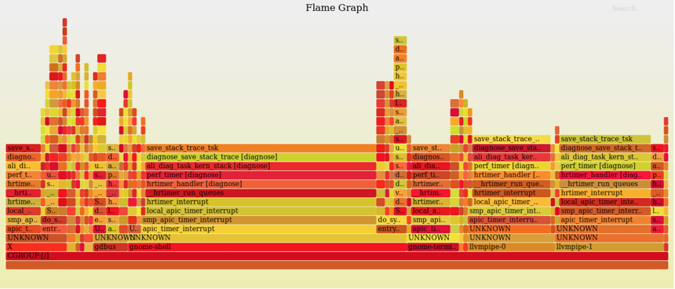

##  pupil小工具
### 查看diagnose-tools版本号
可以执行如下命令来查询版本号：
```
diagnose-tools -v
diagnose-tools -V
diagnose-tools --version
```
结果如下：
```
diagnose-tools tools version 2.0-rc4
```
### 查看线程信息

在容器或者宿主机上面，根据线程PID，输出其线程信息：

* 线程所在的CGROUP名称
* PID
* 进程名称
* 进程链信息
* 内核态堆栈

在控制台中运行如下命令查看线程信息：
```
diagnose-tools task-info --pid=$PID
```
其中，$PID是要查看的进程ID。
也可以用如下命令查看进程中所有线程的信息：
```
diagnose-tools task-info --tgid=$PID
```
最后，用如下命令获得结果：
```
diagnose-tools task-info --report
下图是运行结果示例：
线程详细信息： 4959
    时间：[1584776688:293341].
    进程信息： [/ / JS Helper]， PID： 4935 / 4959
##CGROUP:[/]  4959      [013]  采样命中
    内核态堆栈：
#@        0xffffffff8111ac34 futex_wait_queue_me  ([kernel.kallsyms])
#@        0xffffffff8111b8a6 futex_wait  ([kernel.kallsyms])
#@        0xffffffff8111dcb5 do_futex  ([kernel.kallsyms])
#@        0xffffffff8111e055 SyS_futex  ([kernel.kallsyms])
#@        0xffffffff81003c04 do_syscall_64  ([kernel.kallsyms])
#@        0xffffffff8174bfce entry_SYSCALL_64_after_swapgs  ([kernel.kallsyms])
    用户态堆栈：
#~        0x7f28339f9965 __pthread_cond_wait ([symbol])
#~        0x7f282bc82f25 _ZN2JS15PerfMeasurement19canMeasureSomethingEv ([symbol])
#~        0x7f282c080b9e _ZN2JS19PeakSizeOfTemporaryEPK9JSContext ([symbol])
#~        0x7f282c09fc02 _ZN2JS14AddServoSizeOfEP9JSContextPFmPKvEPNS_20ObjectPrivateVisitorEPNS_10ServoSizesE ([symbol])
#~        0x7f28339f5dd5 start_thread ([symbol])
#*        0xffffffffffffff JS Helper (UNKNOWN)
    进程链信息：
#^        0xffffffffffffff /usr/bin/gnome-shell  (UNKNOWN)
#^        0xffffffffffffff /usr/libexec/gnome-session-binary --session gnome-classic  (UNKNOWN)
#^        0xffffffffffffff gdm-session-worker [pam/gdm-password]  (UNKNOWN)
#^        0xffffffffffffff /usr/sbin/gdm  (UNKNOWN)
#^        0xffffffffffffff /usr/lib/systemd/systemd --switched-root --system --deserialize 22  (UNKNOWN)
##
线程详细信息： 4960
    时间：[1584776688:293352].
    进程信息： [/ / llvmpipe-0]， PID： 4935 / 4960
##CGROUP:[/]  4960      [014]  采样命中
    内核态堆栈：
```

注意：启动进程的父进程可能已经退出，这样有可能找不到直接启动进程的父进程。
同样的，可以从上面的输出结果中提取出火焰图。
如：
```
diagnose-tools task-info --tgid=$PID --report > task.log
diagnose-tools flame --input=task.log --output=task.svg
```
## 临时文件转火焰图

sys-delay / irq-delay / load-monitor / perf等功能都能够输出进程堆栈信息，可以将这些信息保存在临时文件中，例如tmp.txt中。
使用如下命令，可以将临时文件中的数据生成火焰图：

```
diagnose-tools flame --input=tmp.txt --output=perf.svg
```
该命令指定了数据来源文件为tmp.txt，并指定火焰图文件为perf.svg。成功后，可以使用浏览器直接打开perf.svg。如下所示：



你可以在浏览器中与火焰图互动：将鼠标移到不同层级的块中，看其详细信息，也可以点击块。

关于火焰图的说明，请参见：http://www.ruanyifeng.com/blog/2017/09/flame-graph.html

